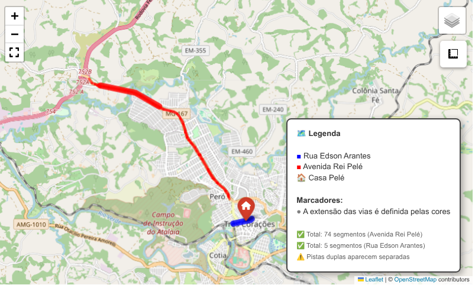

# Mapeamento e análise de vias ubanas com OSMnx

### Introdução

Em Três Corações/MG, há duas vias urbanas em homenagem ao seu filho mais ilustre, além de uma praça controversa: a *Avenida Rei Pelé* e a *Rua Edson Arantes do Nascimento*, onde está situada a [*Casa Pelé*](https://ge.globo.com/mg/sul-de-minas/futebol/noticia/2022/12/29/casa-pele-resgata-memoria-e-mistica-do-local-em-que-o-rei-viveu-ate-os-tres-anos-no-sul-de-minas.ghtml), reconstituição histórica do local onde o craque nasceu. Uma homenageia o mito; a outra, o homem.

Neste projeto, desenvolvemos um código em **Python**, com o auxílio do pacote **Osmnx**, para mensurar a extensão e identificar outros atributos das duas vias, assim como destacar os traçados delas em um mapa interativo no **Folium**.

Em primeiro lugar extraimos todos os elementos viários da região de interesse utilizando a função *ox.features_from_place()*. Depois, convertemos os dados para o sistema de projeção específico para a região do Brasil. Em seguida, realizamos uma busca para retornar os dados necessários para realizar a visualização geográfica e efetuar cálculos métricos. Finalmente, unificamos os segmentos das vias e definimos os padrões gráficos.

### Objetivo

O objetivo consiste em extrair, processar e visualizar todos os segmentos de uma via específica a partir de dados do **OpenStreetMap**, incluisive o tratamento para pistas duplas, segmentos desconectados e projeção precisa para cálculos métricos.

O código desenvolvido foi desenvolvido para identificar todos os trechos dessas vias, unificá-los visualmente e destacar pontos de interesse, como a *Casa Pelé*.

### Bibliotecas

Carregamos as seguintes bibliotecas:


- **osmnx**: biblioteca especializada para modelagem de redes urbanas
a partir de dados do *OpenStreetMap*. Permite baixar grafos viários
reais e calcular rotas. Utilizada para obter a rede de ruas de
Juiz de Fora (raio de 30 km) e calcular caminhos mais curtos.

- **folium**: biblioteca para visualização geoespacial interativa,
baseada em *Leaflet.js*. Plugins *Fullscreen* e *MeasureControl*
adicionam tela cheia e ferramenta de medição ao mapa.

- **pandas**: biblioteca fundamental para análise de dados em Python,
oferece estruturas como *DataFrame* e *Series* para manipulação e
análise de dados tabulares. 

- **numpy**: pacote essencial para computação científica, fornece
suporte a *arrays* multidimensionais e funções matemáticas de
alto desempenho.

- **shapely.geometry**: módulo da biblioteca *Shapely* especializado na definição e manipulação de objetos geométricos fundamentais. Fornece classes como *LineString* (para representar sequências de pontos conectados) e *MultiLineString* (para representar coleções de linhas). Utilizado neste projeto para trabalhar com as geometrias das vias extraídas do OpenStreetMap e identificar a estrutura de cada segmento.

- **shapely.ops**: módulo da biblioteca *Shapely* que implementa operações geométricas avançadas. A função *linemerge* é utilizada para tentar unir múltiplos segmentos de uma mesma via em uma linha contínua, identificando a via principal e tratando casos onde os trechos estão desconectados ou fragmentados.

- **geopandas**: biblioteca que estende o pandas para manipulação de dados geoespaciais. Combina as capacidades do *pandas* com as funcionalidades geométricas do *Shapely*, permitindo armazenar geometrias, calcular áreas, comprimentos e realizar operações espaciais. Neste projeto, é utilizada para manipular os dados vetoriais baixados do *OpenStreetMap*, aplicar projeções **UTM** e acessar as propriedades geométricas dos segmentos viários.

- **warnings**: módulo da biblioteca padrão para controle de mensagens de aviso. Utilizado para suprimir alertas técnicos e manter a saída limpa e focada nos resultados.


```python
import osmnx as ox
import folium
import pandas as pd
import numpy as np
from shapely.geometry import LineString, MultiLineString
from shapely.ops import linemerge
from folium.plugins import MeasureControl, Fullscreen
import geopandas as gpd
import warnings
warnings.filterwarnings('ignore')
```

### Definimos os limites geográficos


```python
place = "Três Corações, Minas Gerais, Brazil"
```

### Extraímos dados espaciais

A primeira etapa consiste em obter todos os elementos viários da região de interesse utilizando a função *ox.features_from_place()*. Esta função retorna todos os elementos geométricos (linhas, polígonos, pontos) que possuem a tag *highway*, garantindo a captura completa da infraestrutura viária.


```python
gdf = ox.features_from_place(place, tags={"highway": True})
```

### Convertermos para a projeção UTM

Os dados brutos do **OpenStreetMap** estão em coordenadas geográficas (*WGS84 - EPSG:4326*), que não são ideais para cálculos de distância devido às distorções da curvatura terrestre. Para resolver esse problema, convertemos os dados para o sistema de projeção *UTM - EPSG:31983* (*SIRGAS 2000*, Zona 23S), específico para a região do Brasil. Essa projeção minimiza distorções e permite cálculos precisos de comprimento em metros.


```python
gdf_utm = gdf.to_crs("EPSG:31983")
```

### Função para encontrar todos os segmentos de uma via

Definimos a função *encontrar_todos_segmentos()*, que implementa uma busca inteligente baseada em expressões regulares parciais nos nomes das vias, e retorna dois objetos:
*segmentos originais*, para visualização geográfica e *segmentos projetados*, para cálculos métricos precisos.


```python
def encontrar_todos_segmentos(gdf_original, gdf_utm, nomes_possiveis):
    """
    Encontra TODOS os segmentos de uma via, incluindo pistas duplas
    e segmentos desconectados.
    """
    mascara = pd.Series(False, index=gdf_original.index)
    
    for nome in nomes_possiveis:
        mascara |= gdf_original["name"].str.contains(nome, case=False, na=False)
    
    segmentos_original = gdf_original[mascara].copy()
    
    if segmentos_original.empty:
        print(f" Nenhum segmento encontrado para: {nomes_possiveis}")
        return None
    
    # Pega os mesmos índices na projeção UTM
    segmentos_utm = gdf_utm.loc[segmentos_original.index].copy()
    
    # Calcula comprimentos com projeção correta
    comprimentos = segmentos_utm.geometry.length  # em metros (já na projeção)
    
    print(f"\n Encontrados {len(segmentos_original)} segmentos para '{nomes_possiveis[0]}'")
    
    # Analisa os tipos de geometria
    geom_types = segmentos_original.geometry.geom_type.value_counts()
    print("    Tipos de geometria:")
    for geom_type, count in geom_types.items():
        print(f"      - {geom_type}: {count}")
    
    print(f"    Comprimento total: {comprimentos.sum():.0f} metros")
    print(f"    Comprimento médio: {comprimentos.mean():.0f} metros")
    print(f"    Número total de trechos: {len(segmentos_original)}")
    
    return segmentos_original, segmentos_utm
```

### Localizamos todos os segmentos da *Avenida Rei Pelé*


```python
segmentos_rei_orig, segmentos_rei_utm = encontrar_todos_segmentos(
    gdf, gdf_utm,
    [
        "Avenida Rei Pelé",
        "Av. Rei Pelé",
        "Avenida Deputado Renato Azeredo",
        "Av. Deputado Renato Azeredo",
        "Rei Pelé"
    ]
)
```

    
     Encontrados 74 segmentos para 'Avenida Rei Pelé'
        Tipos de geometria:
          - LineString: 74
        Comprimento total: 11817 metros
        Comprimento médio: 160 metros
        Número total de trechos: 74


### Localizamos todos os segmentos da *Rua Edson Arantes*


```python
segmentos_edson_orig, segmentos_edson_utm = encontrar_todos_segmentos(
    gdf, gdf_utm,
    [
        "Rua Edson Arantes do Nascimento",
        "Edson Arantes",
        "Rua Edson Arantes"
    ]
)
```

    
     Encontrados 5 segmentos para 'Rua Edson Arantes do Nascimento'
        Tipos de geometria:
          - LineString: 5
        Comprimento total: 576 metros
        Comprimento médio: 115 metros
        Número total de trechos: 5


### Criamos o mapa


```python
mapa = folium.Map(location=[-21.697, -45.253], zoom_start=15)
```

### Definimos uma função para adicionar as vias no mapa

A função *linemerge()*, da biblioteca **Shapely**, une os segmentos individuais em uma linha contínua, identificando a via principal. Ambas as vias apresentaram apenas geometrias do tipo *LineString*, indicando que não há polígonos ou pontos isolados associados a essas ruas no **OpenStreetMap**. 


```python
def adicionar_via_completa(segmentos_orig, segmentos_utm, nome_exibicao, cor_principal):
    """Adiciona TODOS os segmentos da via ao mapa com destaque"""
    
    if segmentos_orig is None or segmentos_orig.empty:
        print(f" Via '{nome_exibicao}' não encontrada.")
        return
    

    try:
        # Tenta unir todos os segmentos em uma única linha
        todas_geometrias = list(segmentos_orig.geometry)
        linha_unida = linemerge(todas_geometrias)
        
        if linha_unida.geom_type == "MultiLineString":
            # Pega a linha mais longa (via principal)
            linha_principal = max(linha_unida.geoms, key=lambda x: x.length)
            print(f"   📍 Via principal identificada (mais longa)")
        else:
            linha_principal = linha_unida
        
        # Desenha a via principal em destaque
        if linha_principal.geom_type == "LineString":
            coords = list(linha_principal.coords)
            folium.PolyLine(
                locations=[(lat, lon) for lon, lat in coords],
                color=cor_principal,
                weight=10,
                opacity=0.8,
                popup=f"{nome_exibicao} (VIA PRINCIPAL)",
                tooltip=f"{nome_exibicao}"
            ).add_to(mapa)
            
            
    except Exception as e:
        print(f"   ⚠️ Erro ao unir segmentos: {e}")
    
    # ---  TODOS OS SEGMENTOS INDIVIDUAIS ---
    print(f"    Desenhando {len(segmentos_orig)} segmentos individuais...")
    
    for idx, row in segmentos_orig.iterrows():
        geom = row.geometry
        
        # Extrai coordenadas
        if geom.geom_type == "LineString":
            coords = list(geom.coords)
            desenhar_segmento(coords, cor_principal)
        elif geom.geom_type == "MultiLineString":
            # Para MultiLineString, desenha cada parte
            for part in geom.geoms:
                coords = list(part.coords)
                desenhar_segmento(coords, cor_principal)
        else:
            print(f"   ⚠️ Geometria ignorada: {geom.geom_type}")
            continue
```

### Realçamos os segmentos das vias de interesse


```python
def desenhar_segmento(coords, cor):
    """Desenha um segmento individual sem marcadores extras"""
    
    # Linha do segmento
    folium.PolyLine(
        locations=[(lat, lon) for lon, lat in coords],
        color=cor,
        weight=4,
        opacity=0.6,
    ).add_to(mapa)

# 9. Adiciona as vias ao mapa
print("\n📊 Processando Rua Edson Arantes...")
adicionar_via_completa(
    segmentos_edson_orig, 
    segmentos_edson_utm,
    "Rua Edson Arantes do Nascimento", 
    "blue"
)

print("\n📊 Processando Avenida Rei Pelé...")
adicionar_via_completa(
    segmentos_rei_orig,
    segmentos_rei_utm,
    "Avenida Rei Pelé", 
    "red"
)

```

    
    📊 Processando Rua Edson Arantes...
        Desenhando 5 segmentos individuais...
    
    📊 Processando Avenida Rei Pelé...
       📍 Via principal identificada (mais longa)
        Desenhando 74 segmentos individuais...


### Adicionamos um ponto de interesse especial


```python
casa_pelé_coords = (-21.694709, -45.255379)

folium.Marker(
    location=[casa_pelé_coords[0], casa_pelé_coords[1]],
    popup="""
    <b>🏠 Casa Pelé</b><br>
    <i>Local onde nasceu o Rei do futebol</i><br>
    """,
    tooltip="🏠 Casa Pelé",
    icon=folium.Icon(
        color="gold",
        icon="home",
        prefix="fa"
    )
).add_to(mapa)
```


    <folium.map.Marker at 0x782c4d110800>


### Adicionamos legendas


```python
legend_html = """
<div style="position: fixed; bottom: 20px; right: 20px; z-index: 1000; 
            background-color: white; padding: 15px; border-radius: 8px; 
            border: 2px solid #444; font-family: Arial; font-size: 13px;
            max-width: 320px; box-shadow: 3px 3px 10px rgba(0,0,0,0.3);">
    <b>🗺️ Legenda</b><br><br>
    <span style="color: blue; font-weight: bold;">■</span> Rua Edson Arantes<br>
    <span style="color: red; font-weight: bold;">■</span> Avenida Rei Pelé<br>
    <span style="color: gold; font-weight: bold;">🏠</span> Casa Pelé<br><br>
       
    <b>Marcadores:</b><br>
    <span style="color: gray;">●</span> A extensão das vias é definida pelas cores<br><br>
    
    <span style="font-size: 11px; color: #666;">
    ✅ Total: 74 segmentos (Avenida Rei Pelé)<br>
    ✅ Total: 5 segmentos (Rua Edson Arantes)<br>
    ⚠️ Pistas duplas aparecem separadas
    </span>
</div>
"""
mapa.get_root().html.add_child(folium.Element(legend_html))
```


    <branca.element.Element at 0x782c4d2f9ca0>


### Adicionamos controle de camadas e plugins


```python
folium.LayerControl().add_to(mapa)
MeasureControl().add_to(mapa)
Fullscreen().add_to(mapa)
```


    <folium.plugins.fullscreen.Fullscreen at 0x782c4d2fb7d0>


### Visualizamos o mapa


```python
display(mapa)
```



**Considerações finais:*

Demonstramos de forma didática como realizar o mapeamento e análise de vias urbanas utilizando **OSMnx**. A combinação de extração completa de dados, projeção métrica precisa e visualização interativa resulta em uma ferramenta poderosa para estudos urbanos, roteirização e análise de infraestrutura viária.

O estudo de caso apresentado, que serviu como exemplo prático, envolvendo a *Avenida Rei Pelé* e *Rua Edson Arantes do Nascimento*, em Três Corações/MG, permitiu a identifição de 74 e 5 segmentos respectivamente, com comprimentos totais de 11,8 km e 576 metros, respectivamente. A inclusão da **Casa Pelé** como ponto de interesse demonstra a flexibilidade da ferramenta para adicionar marcadores personalizados.


```python

```
